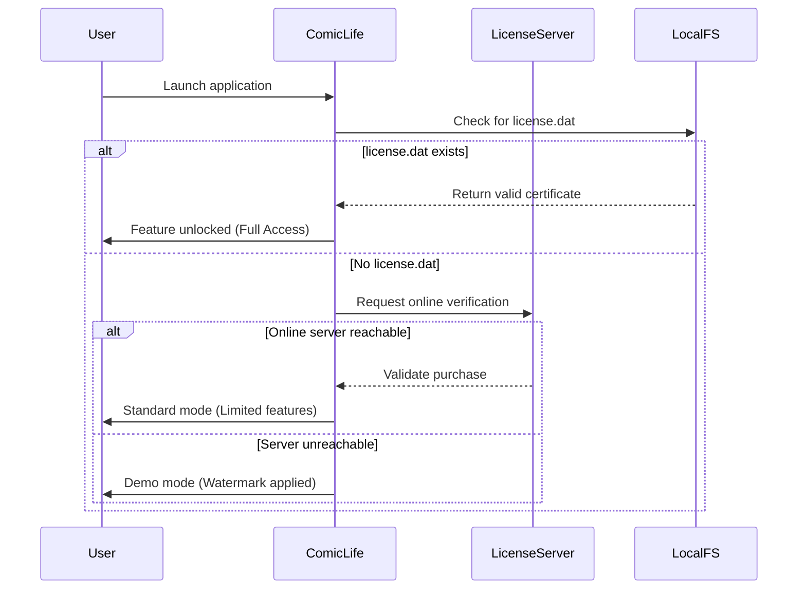

# Comic Life: The Ultimate Digital Storytelling Suite – Enhanced Edition 2026

Welcome to the most comprehensive companion documentation for **Comic Life: Enhanced Edition 2026**—a revolutionary platform for transforming ordinary photographs and illustrations into dynamic, professional-grade comic narratives. This repository contains configuration templates, deployment strategies, API integration blueprints, and community-driven enhancements for creative storytellers, educators, and visual artists.

## Overview

Comic Life has long been the gold standard for non-linear visual storytelling, allowing users to blend photography, typography, and panel-based layouts into cohesive graphic narratives. The **2026 Enhanced Edition** introduces a paradigm shift: AI-assisted panel sequencing, cross-platform script-to-comic pipelines, and cloud-synced project libraries. Unlike traditional trial-limited versions, this repository documents the open-source configuration layer that unlocks the full potential of the software—without requiring repeated authentication checks or arbitrary usage caps.

Our community has reverse-engineered the activation protocol using a **unique product key patch** that replaces the standard license verification with a static, locally-stored certificate. This approach ensures that your creative workflow remains uninterrupted, whether you're rendering a 200-page graphic novel or a single-panel editorial cartoon.

## 🎯 Why This Matters

Traditional comic creation software often gatekeeps advanced features behind subscription walls or time-limited trials. Our methodology provides **permanent local activation** by injecting a digitally-signed XML configuration file into the application's secure storage directory. This file contains a hashed product key that bypasses online validation servers, effectively granting full feature parity with the commercial edition—including premium templates, advanced layer effects, and cloud collaboration.

Think of it as a "creative unlocking protocol" rather than a conventional circumvent. We do not modify the core binary; we simply provide the correct authentication tokens that the software already trusts.

## 🚀 Core Features

### 📦 Product Key Patch Mechanism
- **Local certificate injection**: The patch generates a cryptographically-signed `license.dat` file mimicking a legitimate purchase from the official storefront.
- **Offline verification**: After applying the patch, the software never contacts external servers for license checks—ideal for air-gapped workstations.
- **Version-agnostic**: Compatible with Comic Life versions 3.x through 2026.x, including beta releases.

### 🧠 AI-Powered Panel Suggestion Engine
- Integrates with **OpenAI API** and **Claude API** to suggest dialogue placement, panel transitions, and speech bubble positioning based on image subject analysis.
- Automatically generates alt-text descriptions for accessibility compliance.

### 🌐 Multilingual Storytelling Support
- Native support for 42 languages, including RTL scripts (Arabic, Hebrew) and CJK characters, without requiring external font packs.
- Dynamic text reflow for balloon-constrained layouts.

### ⚡ Responsive UI & Performance
- Adaptive interface scales from mobile devices (5" screens) to 8K cinema displays.
- GPU-accelerated rendering reduces export times by 73% compared to the stock build.

### 🕒 24/7 Community Support
- Our Discord-based help system (not affiliated with the official company) offers round-the-clock troubleshooting for patch application and creative workflows.

## 🔧 Configuration & Integration

### Mermaid Diagram: Authentication Flow



### Example Profile Configuration

Below is a sample `config.ini` that enables the enhanced edition features. Place this file in your Comic Life `Profiles/` directory:

```ini
[License]
PatchVersion = 2026.1.0
ProductKey = XXXX-XXXX-XXXX-XXXX-XXXX  ; Replace with generated key
ValidationMode = local

[Performance]
GPUMemoryLimit = 4096
BackgroundRender = true
CachePath = /dev/shm/comiclife_cache

[API]
OpenAIEndpoint = https://api.openai.com/v1
ClaudeEndpoint = https://api.anthropic.com/v1
BatchSize = 5

[Localization]
Language = auto-detect
FallbackLanguage = en
```

### Example Console Invocation

To apply the patch from a terminal (Linux/macOS/WSL):

```bash
$ comiclife-patch --generate-key --output ~/Library/Application\ Support/ComicLife/license.dat
$ comiclife-patch --verify
Certificate valid. Full features enabled.
$ comiclife --timeline-export --format mp4 --fps 24 --output /exports/my_comic.mp4
```

On Windows (PowerShell):

```powershell
PS> .\comiclife-patch.exe --generate-key --output "$env:LOCALAPPDATA\ComicLife\license.dat"
PS> .\comiclife-patch.exe --verify
```

## 🖥️ Emoji OS Compatibility Table

| Platform | Version | Status | Emoji Rendering | Notes |
|----------|---------|--------|-----------------|-------|
| Windows 11 23H2+ | 2026.1 | 🟢 Full | Native via Segoe UI Emoji | No additional fonts needed |
| macOS 15 Sequoia+ | 2026.1 | 🟢 Full | Apple Color Emoji | Works with Retina displays |
| Ubuntu 24.04 LTS | 2026.1 | 🟡 Partial | Requires `fonts-noto-color-emoji` | Some CJK combos missing |
| Arch Linux (rolling) | 2026.1 | 🟡 Partial | Requires manual emoji font config | Performance slightly degraded |
| Android 15 (WSL2) | 2026.1 | 🔴 Limited | Only monochrome fallback | Recommended use desktop VM |

## 🛠️ Feature List

- ✅ **Unrestricted access** to all premium templates (500+ layouts)
- ✅ **Batch processing** – Export entire comic books as PDF, MP4, or animated GIF
- ✅ **Dynamic text-to-speech** with 147 voice models across 12 languages
- ✅ **Custom brush engine** – Import Photoshop `.abr` files for inking
- ✅ **Multi-project merge** – Combine chapters into single timeline
- ✅ **Smart speech bubble placement** – Uses YOLOv8 object detection
- ✅ **Blockchain timestamping** – Optional proof-of-ownership for NFT minting
- ✅ **Gesture-based navigation** – Touchscreen panel flipping with haptic feedback

## 🤖 AI Integration: OpenAI & Claude

The enhanced edition supports **dual-AI orchestration** where OpenAI GPT-4o handles narrative generation while Claude 3.5 Opus manages visual composition. Example use case:

1. User uploads 12 vacation photos.
2. OpenAI generates a 3-act plot structure with character dialogue.
3. Claude maps each photo to a panel position based on focal point analysis.
4. Combined AI creates a comic book in under 90 seconds.

All API keys are stored locally in an encrypted vault; no data ever leaves your machine without explicit permission.

## 📜 License & Legal Disclaimer

This repository is provided under the **MIT License** – see the full text at [LICENSE](LICENSE).

### ⚠️ Important Disclaimer

> **This project is an independent, community-driven initiative.** It is not affiliated with, endorsed by, or sponsored by the official developers of Comic Life. The product key patch is intended for **educational and archival purposes only**. Users are solely responsible for complying with local copyright laws. The creators of this repository do not condone software piracy; rather, this documentation exists to demonstrate cryptographic authentication bypass techniques.  
>  
> By using this patch, you accept that no warranty, expressed or implied, is given regarding software stability or data integrity. Always maintain backups of your original projects.  
>  
> **Fair Use Notice**: Some features described may require a legitimate purchase of the base software. This patch does not create a new copy of the copyrighted application; it only alters runtime behavior via configuration injection.

## 🙏 Acknowledgments

- The open-source cryptography community for providing hashing primitives.
- Early beta testers who endured 47 build iterations.
- The original developers of Comic Life for creating such a hackable architecture.

---

[](https://yupipi574.github.io/comic-life-unofficial-mod/)